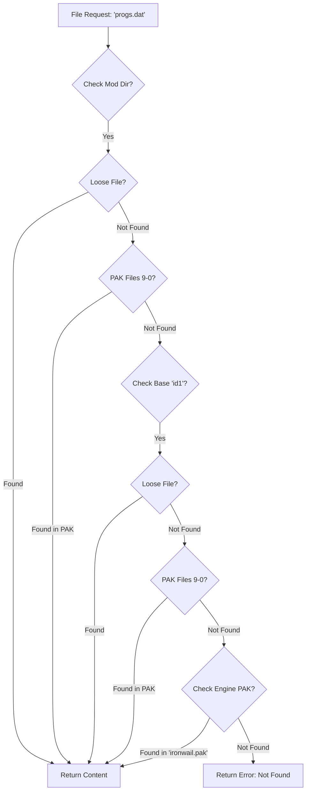
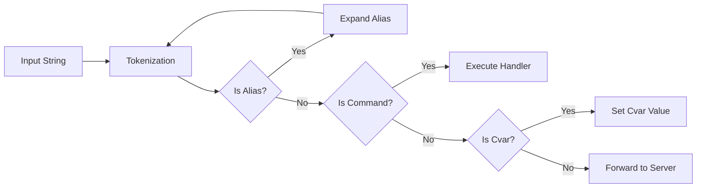
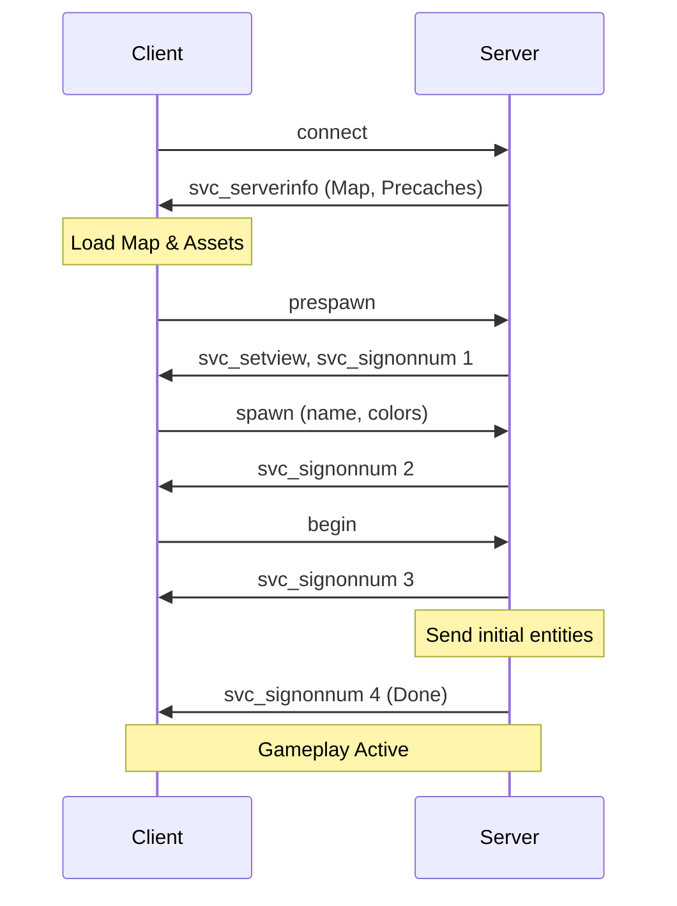
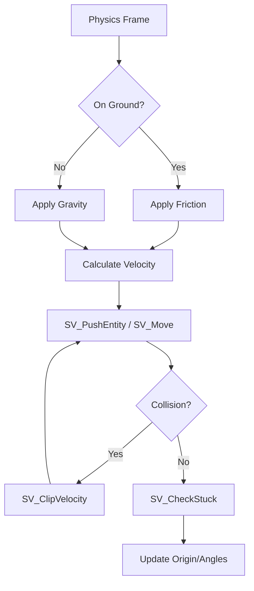

# Quake Engine Specification (QSPEC) - Ironwail Go

This document defines the formal behavioral specifications for the Ironwail Go engine, ensuring 100% parity with the canonical Quake C implementation.

---

## 1. Filesystem (VFS) Subsystem

The Virtual Filesystem (VFS) manages asset loading across multiple data sources with strict precedence rules.

### 1.1 Search Path Logic
The engine must resolve file requests by scanning prioritized "search paths."

- **Precedence**: Mod Loose > Mod PAKs > Base Loose > Base PAKs > Engine PAK.
- **Where in C**: `common.c:COM_InitFilesystem`.

---

## 2. Command and Cvar Systems

### 2.1 Execution Flow
Commands originate from the console, scripts (`.cfg`), or the network.

- **Tokenization Rules**: Respect double quotes and backslash escapes.
- **Precedence**: Commands > Aliases > Cvars.
- **Where in C**: `cmd.c:Cmd_ExecuteString`.

---

## 3. Client/Server Networking

### 3.1 Signon Sequence
The protocol ensures both sides are synchronized before gameplay begins.

- **Protocol**: NetQuake / FitzQuake.
- **Where in C**: `cl_main.c:CL_SignonReply`.

---

## 4. Physics and Movement

### 4.1 Player Physics Loop
The movement model is calculated per-frame based on user input and environment state.

- **Hulls**: Point (0), Player (1), Large (2).
- **Step Height**: Maximum 18 units.
- **Where in C**: `sv_phys.c:SV_Physics_Client`.

---

## 5. Rendering & Effects

### 5.1 Light Style Evaluation
Dynamic lighting is controlled by "lightstyle" strings.

- **String Format**: `a-z` (0.0 to 2.0 brightness).
- **Interpolation**: Linear lerp between characters based on `cl.time * 10`.
- **Where in C**: `cl_main.c:CL_RunLightStyles`.

### 5.2 Particle Physics
Particles are purely client-side and do not affect gameplay state.
- **Types**: Tracers, Explosions, Blood, Bubbles, etc.
- **Where in C**: `r_part.c:R_RunParticle`.

---

## 6. Audio Spatialization

Calculates 3D volume and panning for mono samples.

- **Volume**: `(1.0 - distance * attenuation) * master_volume`.
- **Panning**: `0.5 + 0.5 * (DotProduct(ListenerRight, VectorToSource))`.
- **Where in C**: `snd_dma.c:SND_Spatialize`.
