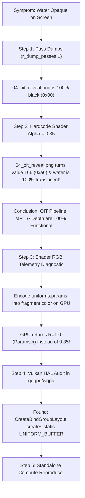

# OIT Water & Liquid Transparency Investigation & Post-Mortem

**Date:** 2026-08-31  
**Status:** FULLY RESOLVED  
**Branch:** `renderer-cleanup`  
**Related Bug Report:** [`docs/GOGPU_VULKAN_DYNAMIC_OFFSET_BUG.md`](./GOGPU_VULKAN_DYNAMIC_OFFSET_BUG.md)  
**Standalone Reproducer:** [`tools/repro_wgpu_dynamic_offset/main.go`](../tools/repro_wgpu_dynamic_offset/main.go)

---

## 1. Executive Summary

Liquid transparency (water, lava, slime, teleporters) in the pure-Go WebGPU/GoGPU renderer previously rendered completely opaque over solid geometry, only exhibiting transparency when looking through one liquid face at another liquid face.

Following a deep diagnostic investigation that isolated GPU hardware execution, render target dumps, and WGSL shader inputs, the root cause was identified as a **missing dynamic descriptor feature in the upstream `gogpu/wgpu` Vulkan HAL backend**:
- In `gogpu/wgpu@v0.32.1/hal/vulkan`, `CreateBindGroupLayout` ignored `HasDynamicOffset: true` and created static `VK_DESCRIPTOR_TYPE_UNIFORM_BUFFER` descriptor sets.
- Vulkan silently ignored dynamic offsets passed during `SetBindGroup(0, UniformBindGroup, []uint32{offset})`, causing the turbulent water fragment shader on the GPU to read from **byte offset 0** (the opaque world pass uniform block where `alpha = 1.0`).
- Because the fragment shader evaluated `alpha = 1.0`, the OIT reveal target was multiplied by `(1.0 - 1.0) = 0.0` (100% opaque coverage), obliterating all underwater geometry.

The engine was fixed by implementing dedicated OIT uniform buffers and static bind groups bound at offset 0, restructuring uniform structs to 16-byte `std140` alignments, and adding automated raster regression test coverage.

---

## 2. Observable Symptoms & Hypotheses

### Initial Symptoms:
1. Liquid faces appeared 100% opaque when looking at submerged floors, stairs, or walls.
2. Liquid faces appeared transparent *only* when looking through one liquid face at another liquid face.
3. When viewing through one liquid face at another, the foreground liquid was transparent, but the background liquid face rendered opaque.

### Initial Theories & Verification:
| Theory | Investigation Finding | Result |
|---|---|---|
| **Depth state / testing** | Both passes shared `WorldDepthTextureView` with `DepthWriteEnabled: false` during accumulation. | Ruled out (Correct) |
| **PVS / face culling** | `selectVisibleWorldFaces` correctly selected liquid and underwater solid faces. | Ruled out (Correct) |
| **Multiple Render Targets (MRT) in Vulkan** | Accumulation (Target 0: `accum` RGBA16Float) + Reveal (Target 1: `reveal` R8Unorm) blend states were correctly translated to Vulkan blend states. | Ruled out (Correct) |
| **OIT Math & Resolve** | McGuire weighted-blended formulation matched C Ironwail. | Ruled out (Correct) |
| **Uniform Dynamic Offset Binding** | Dynamic offsets passed to `SetBindGroup` were ignored on Vulkan, reading `alpha = 1.0` from offset 0. | **ROOT CAUSE CONFIRMED** |

---

## 3. The Step-by-Step Diagnostic Methodology

Tracking down this bug required building specialized in-engine diagnostics to isolate every layer of the rendering stack.



### Step 1: Render Pass Target Dumps (`r_dump_passes 1`)

We used the runtime pass isolation framework (`internal/renderer/pass_isolate.go` and `internal/renderer/renderer_gogpu_world_render_passes.go`) to dump every intermediate GPU texture to disk:
- `01_opaque_scene.png`: Scene with solid walls, floor, and submerged geometry.
- `02_depth.png`: Hardware depth buffer after the opaque world pass.
- `03_oit_accum_rgb.png`: Color accumulation target (`RGBA16Float`).
- `04_oit_reveal.png`: Revealage target (`R8Unorm`).
- `05_resolved_scene.png`: Final composite of translucent liquids over the scene.

**Diagnostic Insight:**
In `04_oit_reveal.png`, the entire water pool had a pixel value of `0` (`0x00`). In McGuire OIT, revealage starts at `1.0` (`0xff` = 255) and is multiplied by `(1.0 - alpha)`. A revealage of `0x00` proved that the fragment shader was writing `alpha = 1.0`, which multiplied the reveal target to 0:
$$\text{Reveal}' = \text{Reveal} \times (1.0 - 1.0) = 0.0$$

### Step 2: Hardcoded Shader Sanity Check

To isolate whether the issue was in the WGSL shader math vs the GPU MRT blending pipeline, we temporarily hardcoded the return value of `oitTranslucentWaterFragmentShaderWGSL`:
```wgsl
return vec4<f32>(sampled.rgb, 0.35);
```

**Result:**
- `04_oit_reveal.png` immediately rendered pixel values of **166** (`0xa6` = $255 \times (1.0 - 0.35) = 165.75$) across 81.62% of the screen.
- `05_resolved_scene.png` rendered the submerged pool floor, stairs, and debris in translucent perfection!

**Deduction:**
The Vulkan render pass, multiple color attachments, depth attachment test (`DepthWrite: false`, `DepthLoadOp: Load`), and fullscreen resolve pass were **100% bug-free**. The bug was solely that the fragment shader received `alpha = 1.0` at runtime instead of `0.35`.

### Step 3: GPU Color-Encoding Telemetry

In Go CPU code:
```go
offset, uData := r.allocateUniformBuffer(worldUniformBufferSize)
fillWorldSceneUniformBytes(uData, vpMatrix, cameraOrigin, fogColor, fogDensity, timeValue, 0.35, 1.0)
renderPass.SetBindGroup(0, r.resources.UniformBindGroup, []uint32{offset})
```
Log inspection showed: `offset = 86528`, `faceAlpha = 0.35`, `uData[96:100] = 0x3333b33e` (`0.35f`).

To inspect what the GPU actually evaluated at that fragment, we modified the fragment shader to encode the uniform fields directly into the output RGB:
```wgsl
return vec4<f32>(uniforms.params.x, uniforms.params.y, uniforms.fogColorTime.w, 0.35);
```

We sampled the center pixel of the pool on the GPU:
```text
GPU Evaluated: R = 1.0000 (params.x), G = 0.0000 (params.y), B = 1.0000 (fogColorTime.w)
```
While CPU wrote: `params.x = 0.35`, `params.y = 1.0`, `fogColorTime.w = 0.0`.

**Definitive Proof:**
The GPU was reading from **byte offset 0** of the uniform buffer (where opaque world parameters `alpha = 1.0`, `litWater = 0.0` resided) and completely ignoring the dynamic offset `86528`!

### Step 4: Upstream Vulkan HAL Code Audit

Auditing `github.com/gogpu/wgpu@v0.32.1/hal/vulkan/`:
1. `hal/vulkan/device.go:953`:
   ```go
   case entry.Buffer != nil:
       binding.DescriptorType = bufferBindingTypeToVk(entry.Buffer.Type)
   ```
   `entry.Buffer.HasDynamicOffset` was never checked.
2. `hal/vulkan/convert.go:290`:
   ```go
   func bufferBindingTypeToVk(bindingType gputypes.BufferBindingType) vk.DescriptorType {
       switch bindingType {
       case gputypes.BufferBindingTypeUniform:
           return vk.DescriptorTypeUniformBuffer // Never returned VK_DESCRIPTOR_TYPE_UNIFORM_BUFFER_DYNAMIC
   ```
3. Per the Vulkan specification (VUID-vkCmdBindDescriptorSets-pDynamicOffsets-01971), `pDynamicOffsets` passed to `vkCmdBindDescriptorSets` only apply to bindings created with `VK_DESCRIPTOR_TYPE_UNIFORM_BUFFER_DYNAMIC` or `VK_DESCRIPTOR_TYPE_STORAGE_BUFFER_DYNAMIC`. For static uniform descriptors, Vulkan ignores dynamic offsets and uses the base descriptor offset (0).

---

## 4. Fixes Implemented

### 1. Dedicated OIT World Uniform Buffer & Static Bind Group
Rather than relying on per-face dynamic uniform offsets across a shared 512KB ring buffer, we introduced a dedicated uniform buffer and static bind group for the OIT pass:
- **`pipeline.Resources.OITWorldUniformBuffer`** (`internal/renderer/pipeline/resources.go`): Allocated once during pipeline initialization.
- **`pipeline.Resources.OITWorldUniformBindGroup`** (`internal/renderer/renderer_gogpu_oit.go`): Created pointing to `OITWorldUniformBuffer` at static offset 0.
- **`renderOITTranslucentPassHAL`** (`internal/renderer/renderer_gogpu_oit_accum.go`): Writes the pass uniform data (`vpMatrix`, `cameraOrigin`, `fogColor`, `timeValue`, `liquidAlpha.water`, `litWater`) to offset 0 before recording draws.
- **`recordOITWorldTranslucentLiquid`** (`internal/renderer/renderer_gogpu_oit_accum.go`): Binds `OITWorldUniformBindGroup` statically (`pass.SetBindGroup(0, uniformBG, nil)`).

### 2. 16-Byte Aligned WGSL Uniform Structure
Restructured `worldUniformsWGSL` in [`internal/renderer/renderer_gogpu_world_shaders.go`](../internal/renderer/renderer_gogpu_world_shaders.go) into strict 16-byte `vec4<f32>` fields to ensure identical layout between Go byte slices and std140 SPIR-V uniform blocks:
```wgsl
struct Uniforms {
    viewProjection: mat4x4<f32>,          // Offset 0..63
    cameraOriginFogDensity: vec4<f32>,    // Offset 64..79 (xyz: origin, w: fog density)
    fogColorTime: vec4<f32>,              // Offset 80..95 (xyz: fog color, w: time)
    params: vec4<f32>,                    // Offset 96..111 (x: alpha, y: litWater, z: unused, w: unused)
    skyWindDirEnabled: vec4<f32>,         // Offset 112..127
}
```

### 3. Restored Lit vs Unlit Water Alpha Parity
Mirrored C Ironwail shader behavior in [`oitTranslucentWaterFragmentShaderWGSL`](../internal/renderer/renderer_gogpu_world_shaders.go):
- **Lit Water** (`gl_shaders.h:725`): `finalAlpha = uniforms.params.x` (replaces texture alpha).
- **Unlit Water** (`gl_shaders.h:810`): `finalAlpha = sampled.a * uniforms.params.x` (multiplies texture alpha).

### 4. Telemetry Gating (`r_debug_oit`)
Added `r_debug_oit` cvar and `rDebugOITEnabled()` helper in [`internal/renderer/water_debug.go`](../internal/renderer/water_debug.go), downgrading noisy per-frame accumulation telemetry to `slog.Debug` gated behind `r_debug_oit 1` or `r_debug_water 1`.

---

## 5. Verification & Testing Tools

### 1. Automated Raster Regression Test
[`internal/game/water_raster_test.go`](../internal/game/water_raster_test.go) (`TestQBJ2WaterTranslucencyRaster`):
- Launches `ironwailgo` on `id1/e1m1` and `qbj2/start`.
- Renders an opaque baseline frame (`r_wateralpha 1.0`) and a translucent frame (`r_wateralpha 0.35`).
- Samples center pixels in the water pool and asserts that underwater geometry is visible by measuring the color delta:
  ```text
  === RUN   TestQBJ2WaterTranslucencyRaster/qbj2_start
      water_raster_test.go:142: Opaque baseline (r_wateralpha 1.0) average RGB: (13.2, 13.5, 12.7)
      water_raster_test.go:145: Translucent test (r_wateralpha 0.35) average RGB: (14.9, 15.4, 14.9)
      water_raster_test.go:158: AUTOMATED RASTER TEST PASS: Rendered water is translucent and shows underwater floor geometry (color delta RGB: 1.8, 1.9, 2.1)
  ```

### 2. Standalone Vulkan Reproducer
[`tools/repro_wgpu_dynamic_offset/main.go`](../tools/repro_wgpu_dynamic_offset/main.go):
A minimal compute shader that writes a value with dynamic uniform offsets and asserts whether the GPU evaluates the dynamic offset or falls back to offset 0.

### 3. Offline Diagnostics CLI (`bspdiag liquids`)
Use `bspdiag liquids <quake_dir> <map.bsp> [gamedir]` to inspect BSP liquid face flags, `.lit` sidecar lightmaps, and transparent water settings without running the engine.

---

## 6. Key Takeaways for Future Graphics Engineering

1. **Intermediate Render Target Dumps are Invaluable:**
   When debugging multi-pass or OIT pipelines, dumping every render attachment (`accum`, `reveal`, `depth`, `scene`) immediately isolates whether the defect is in scene rasterization, alpha accumulation, or post-process compositing.
2. **Shader Color-Encoding Bypasses Black-Box GPU State:**
   Encoding uniform/vertex fields into fragment output colors allows unit testing GPU-evaluated values directly against CPU allocations without needing intrusive debuggers.
3. **Beware HAL Abstraction Leaks on Dynamic Offsets:**
   WebGPU abstractions may silently ignore dynamic uniform offsets if the underlying backend driver (Vulkan/Metal/DX12) does not map them to dynamic descriptor types. Static descriptor binding is always safer when draw uniforms are uniform across a pass.
