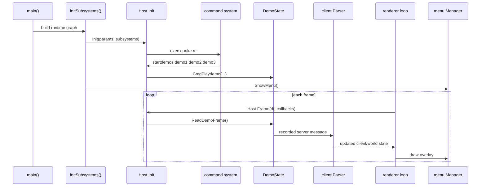

# Guided Walkthrough: Booting to the Menu Screen

This walkthrough follows the engine from process startup to the point where the main menu is visible, including the slightly surprising case where a demo is already playing behind the menu.

The key theme is that Ironwail-Go does not treat the menu, demo playback, renderer, host loop, and client parser as isolated modes. Instead, it wires them together early and then lets the normal frame loop keep advancing whatever is active.

## Big picture

At startup, `cmd/ironwailgo/main.go` creates the process-level configuration, then `cmd/ironwailgo/game_init.go` builds the runtime graph:

- input
- menu and draw manager
- host
- filesystem
- QuakeC VM
- server
- renderer
- audio

After that, `internal/host/init.go` runs the traditional Quake startup script chain. If that chain reaches `startdemos`, demo playback begins through the same client parser used for real server traffic. Finally, `initSubsystems(...)` forces the menu visible with `g.Menu.ShowMenu()`. The result is simple but subtle: the world can already be animating while the menu is drawn on top.

## Control flow, step by step

### 1. `main()` parses startup flags and calls `initSubsystems(...)`

`cmd/ironwailgo/main.go` is the process entry point. It parses flags like `-basedir`, `-game`, `-headless`, `-dedicated`, and any Quake-style `+commands`, then calls:

```go
initSubsystems(headless, dedicated, *baseDir, *gameDir, args)
```

This is where the real engine graph gets constructed.

### 2. `initSubsystems(...)` builds the dependency graph

`cmd/ironwailgo/game_init.go` creates the runtime in a deliberate order:

1. `input.System`
2. `draw.Manager` and `menu.Manager` for non-dedicated runs
3. `host.Host`
4. filesystem
5. QC VM by loading `progs.dat`
6. `server.Server`, with the QC VM attached
7. renderer
8. input backend wiring
9. audio adapter
10. the `host.Subsystems` bundle

That `host.Subsystems` struct is an important abstraction. Instead of letting every package reach into global state, the host gets a compact bundle of the services it needs: files, console, commands, server, input, and audio. This keeps the host scheduler fairly generic.

### 3. The loopback client/server connection is wired before startup scripts run

Still inside `initSubsystems(...)`, `host.SetupLoopbackClientServer(g.Subs, g.Server)` connects the active client state to the authoritative server.

That matters even before the user starts a game: demos, local games, and plenty of parser-driven startup behavior all rely on there being a normal client object around.

### 4. `Host.Init(...)` performs Quake-style startup

`game_init.go` calls:

```go
g.Host.Init(&host.InitParams{...}, g.Subs)
```

Inside `internal/host/init.go`, `Host.Init(...)` performs the classic host bootstrap: configuration, cvars, and startup script execution. The important educational point is that the startup script path is data-driven. The code explicitly executes `quake.rc` when present, and the traditional Quake script chain usually ends with something like:

```text
startdemos demo1 demo2 demo3
```

So demo startup is not hard-coded in `main()`. It is triggered by the command system during initialization.

### 5. `startdemos` does not create a special mode; it just queues demo playback

`internal/host/commands_demo.go` handles the attract-mode commands:

- `CmdStartdemos(...)` stores the playlist
- `CmdDemos(...)` picks the next entry
- `CmdPlaydemo(...)` opens the demo and flips the host into demo playback

`CmdPlaydemo(...)` creates or reuses `host.demoState`, loads the `.dem` data, clears the loopback client state, and marks demo playback active. Importantly, it prepares the client to be bootstrapped by recorded server messages.

This is a recurring engine pattern: rather than inventing a separate demo representation, Ironwail-Go reuses the normal network-message pipeline.

### 6. `initSubsystems(...)` still forces the menu visible

After host initialization, `cmd/ironwailgo/game_init.go` finishes wiring menu integrations and then unconditionally does:

```go
g.Menu.ShowMenu()
```

That means startup can leave the engine in a state where:

- demo playback is already active
- the menu is also active

This is why “demo behind menu” works without a lot of special cases.

### 7. The renderer frame loop advances host/client state, then draws overlays

In renderer mode, `main.go` installs callbacks:

- `Renderer.OnUpdate(...)`
- `Renderer.OnDraw(...)`

`OnUpdate(...)` calls `runRuntimeFrame(dt, cb)`, which:

1. runs `Host.Frame(dt, gameCallbacks{})`
2. advances blend/temp entity state
3. relinks entities
4. predicts players
5. updates audio listener state

Then `OnDraw(...)` renders the world first and overlay UI second. If the menu is active, it calls `g.Menu.M_Draw(...)` after the 3D frame has already been prepared.

That ordering is the direct explanation for “demo behind menu”.

## What happens during demo playback

The demo path lives in `cmd/ironwailgo/game_loop.go`, inside the host frame callbacks.

During `ProcessClient()`, the runtime checks whether the host is in demo playback. If it is:

1. `demoState.ReadDemoFrame()` reads the next recorded frame
2. the frame payload is fed into `client.Parser.ParseServerMessage(...)`
3. the client state updates exactly as if a server had just sent that packet
4. `bootstrapDemoPlaybackWorld(...)` ensures the world model is loaded from `client.ModelPrecache[0]`

So the recorded demo is effectively pretending to be a server stream. That is a clever reuse of the parser and client-state machinery, and it avoids maintaining two separate implementations of “how the client learns about the world”.

When the demo ends, the runtime does not perform some giant mode switch. It queues `demos\n` back into the command path so attract mode continues through the ordinary command system.

## Data flow

The data flow is easier to understand if you split it into three streams.

### Startup configuration flow

```text
CLI flags / +commands
  -> main()
  -> initSubsystems(...)
  -> Host.Init(...)
  -> command system executes startup scripts
```

### Demo playback flow

```text
demo file bytes
  -> host.DemoState
  -> ReadDemoFrame()
  -> client.Parser.ParseServerMessage(...)
  -> client state / model precache / entity state
  -> renderer world and entity collection
```

### UI flow

```text
menu manager state
  -> renderer overlay phase
  -> M_Draw(...)
  -> 2D menu on top of 3D world
```

## Sequence diagram



## Subsystems that get activated

By the time the menu is visible, these subsystems may already be active:

- input routing
- command buffer / console
- filesystem and pak lookup
- QuakeC VM
- authoritative server object
- active client state
- demo playback state
- renderer
- audio listener and transient sound routing
- menu manager

This is why startup can feel surprisingly “live”: the menu is not a shell around the engine. It is one participant inside an already-running engine.

## Non-obvious design choices worth studying

### The `Game` struct is a runtime composition root

Instead of making every package a singleton, `cmd/ironwailgo/main.go` uses a `Game` struct as a top-level container. That keeps cross-subsystem wiring explicit.

### The host is a scheduler, not a monolith

`internal/host/frame.go` defines the host’s frame orchestration through callbacks. The host owns frame order and state transitions, but the runtime-specific work lives in `cmd/ironwailgo/game_loop.go`.

### Demos reuse the real parser

This is one of the smartest patterns in the codebase. A demo frame is just another stream of server messages, so the demo path piggybacks on real client parsing, precache handling, signon-like bootstrapping, and entity update logic.

### The menu is an overlay, not a separate world

The renderer draws the 3D scene and then the menu. That is conceptually simpler than “switching into menu mode”, and it naturally supports the classic Quake attract-mode presentation.

## If you want to keep reading

The most relevant files for this walkthrough are:

- `cmd/ironwailgo/main.go`
- `cmd/ironwailgo/game_init.go`
- `cmd/ironwailgo/game_loop.go`
- `internal/host/init.go`
- `internal/host/commands_demo.go`
- `internal/menu/manager.go`

