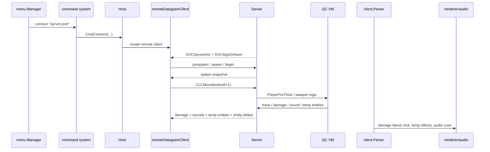

# Guided Walkthrough: Joining a Multiplayer Game and Shooting Another Player

This walkthrough follows a multiplayer combat interaction from the menu all the way to hit feedback on the client.

There is one critical caveat up front: most actual weapon and combat rules do **not** live in Go source in this repository. They mostly live in the loaded QuakeC program, `progs.dat`. The Go engine provides the transport, authority, physics, tracing, message writing, parsing, rendering, and audio plumbing around those rules.

That split is the main thing to understand.

## Big picture

The full path looks like this:

1. the menu queues `connect "<address>"`
2. the host creates a remote transport client
3. the client and server complete signon
4. the player presses attack
5. the client turns that into a `UserCmd` with button bit 0 set
6. the server runs authoritative player/QC logic
7. combat code emits damage, sounds, temp entities, and entity deltas
8. clients parse those messages into visual/audio feedback

So the local input is tiny, but the downstream system involves nearly every engine subsystem.

## Control flow, step by step

### 1. The multiplayer menu queues a `connect` command

The flow starts in the menu code:

- `internal/menu/menu_main.go` enters multiplayer menus
- `internal/menu/menu_game.go` handles Join Game
- `applyJoinGame()` emits `connect "<address>"`

As with single-player, the menu acts mostly as a command producer.

### 2. `Host.CmdConnect(...)` decides local vs remote

`internal/host/commands_network.go` handles `connect`. The host tears down the previous session as needed and then chooses either:

- a local session
- or a remote datagram session

For a real multiplayer server, it creates a `remoteDatagramClient`.

That transport object is the runtime bridge between the client state and the UDP connection.

### 3. The remote session resets signon state and shows a loading plaque

The host reconnect path resets the client’s signon progress and enables the loading plaque.

That visual behavior matters architecturally: it shows that connection setup is not just network state. UI state also tracks the handshake lifecycle.

### 4. The server begins signon with `SVCServerInfo`

Once the server accepts the client, the server-side path seeds the new client slot and emits initial reliable messages such as `SVCServerInfo` and `SVCSignOnNum`.

On the client side, `internal/client/parse.go` consumes those messages through the normal parser. The parser updates:

- protocol/game metadata
- precache lists
- signon stage
- client activation state

### 5. The remote client automatically answers signon stages

One of the cleverest parts of the network path is that `internal/host/remote_client.go` automatically sends the expected signon reply strings:

- `prespawn`
- `spawn`
- `begin`

The client notices its signon state and emits the correct next reply in `SendCommand()`.

That means higher-level code does not need to hand-script the handshake every frame.

### 6. The server completes spawn and marks the client active

On the server side, `internal/server/user.go` handles the incoming signon strings in `handleClientStringCommand(...)`.

During this phase it:

- sends signon buffers
- runs spawn logic
- writes the spawn snapshot
- finally marks `client.Spawned = true` on `begin`

Once `Spawned` is true, the client enters the normal per-frame gameplay pipeline.

### 7. Pressing attack updates the client’s attack button state

When the player presses mouse1 or another bound attack key, the game input system resolves that binding to `+attack`.

Just like `+forward`, `+attack` does not fire the weapon immediately. It updates client button state. Later, `Client.AccumulateCmd()` folds that into a `UserCmd`.

For attack, the important detail is that the command sets:

```text
Buttons bit 0
```

### 8. The remote client serializes and sends `CLCMove`

`remoteDatagramClient.SendCommand()` eventually sends the move payload using the normal client networking path. Conceptually, the transmitted packet says:

- here are my current view angles
- here is my movement intent
- here are my button bits
- here is my impulse

So the player’s “shoot” action crosses the network as one bit inside a user command.

### 9. The server decodes the move and updates authoritative client state

On the server side:

- `SV_ReadClientMessage(...)` handles incoming client packets
- `ReadClientMove(...)` decodes the `CLCMove`
- `RunClients()` calls `SV_ClientThink(...)`

The server copies the decoded button bits into authoritative state, including fields like `Button0`.

That is the handoff point from “network input” to “gameplay logic can inspect attack state”.

### 10. QuakeC weapon logic decides what firing means

This is the most important conceptual boundary in the whole walkthrough.

The Go engine does not usually contain hard-coded rules like:

- which weapon fires
- ammo consumption
- refire timing
- hit detection semantics for weapon logic
- how damage is applied to another player

Those mostly live in QuakeC inside `progs.dat`, invoked through hooks such as `PlayerPreThink` and `PlayerPostThink`.

The Go server’s job is to provide the world and authority that QC needs:

- entity state
- tracing and collision
- sound emission
- particle emission
- message writing
- damage-related builtins and globals

So when the attack bit is set, the QC program decides whether a shot actually happens.

### 11. QC crosses back into Go through builtins and server hooks

When QC weapon logic fires, it calls back into engine services through builtins in `internal/qc`, with glue installed by the server.

Typical effects include:

- trace or aim through the world
- damage another entity
- play sounds
- emit particles or temp entities
- write protocol messages

This Go/QC bridge is one of the codebase’s deeper abstractions. The authoritative entity state exists both as Go-side `Edict`/`EntVars` and as QC VM state, and the server has to keep those views synchronized at the right times.

### 12. The server packages the result into reliable and unreliable messages

After gameplay and physics, the server assembles outgoing data:

- per-frame datagrams for current world/entity updates
- reliable per-client messages for state that must arrive

Combat results can appear in several message forms:

- entity state deltas
- sounds
- temp entities such as spikes, explosions, or beams
- damage messages

Different clients may receive different subsets based on visibility and relevance.

### 13. The victim/client parses damage and temporary effects

On the receiving client:

- `parseDamage(...)` stores `DamageSaved`, `DamageTaken`, and `DamageOrigin`
- `ApplyDamage()` updates the damage color shift
- `CalculateDamageKick(...)` computes pitch/roll kick from the damage direction
- `parseTempEntity(...)` records temporary effects such as spikes, explosions, or lightning
- `parseSound(...)` records sound events

This is a nice example of parser code feeding multiple later consumers instead of rendering immediately.

### 14. Per-frame client update turns parsed events into visuals and audio

During `runRuntimeFrame(...)` in `cmd/ironwailgo/game_loop.go`, the client:

- updates color blends
- updates temp entities and beam segments
- relinks entities
- predicts players
- consumes transient events for audio/visual systems

Then the renderer and audio layers use that prepared state.

So “I got shot” on the client side is not one monolithic event. It is the combined effect of:

- damage blend and kick
- temp entities
- sound events
- updated entity positions/animations
- HUD/stat changes

### 15. The other player also sees the result through their own parse/render path

The shooter, the victim, and spectators all receive their own version of the authoritative result, built by the server and then interpreted locally. The shared truth is the server simulation, not any client’s local guess.

## Data flow

### Join flow

```text
menu action
  -> connect command
  -> Host.CmdConnect(...)
  -> remoteDatagramClient
  -> server signon
  -> client signon replies
  -> spawned gameplay client
```

### Attack flow

```text
+attack
  -> client button state
  -> UserCmd.Buttons bit 0
  -> CLCMove
  -> server ReadClientMove(...)
  -> authoritative Button0 / client command state
  -> QC weapon logic
```

### Feedback flow

```text
QC/engine combat result
  -> server messages
  -> parseDamage / parseSound / parseTempEntity / entity updates
  -> view blend / view kick / temp entity state / sounds
  -> renderer + audio output
```

## Sequence diagram



## Subsystems involved

This single multiplayer interaction activates:

- menu manager
- command system
- host network orchestration
- UDP transport
- client parser
- authoritative server frame loop
- QC VM and its builtin bridge
- world tracing / collision
- per-client message assembly
- temp-entity management
- view-blend and view-kick code
- renderer
- audio

## Clever or unintuitive abstractions

### The weapon rules are mostly external

If you try to find “how the shotgun works” only in Go source, the architecture will feel incomplete. The missing piece is that most gameplay rules come from the loaded QC program.

### The client handshake is partly automatic

`remoteDatagramClient` quietly handles signon reply strings, which keeps the higher-level host code simpler.

### One input bit fans out into many client-side effects

The attack button itself is tiny. The visible result comes later through authoritative messages that feed blend code, beam/temp entity code, sounds, and entity animation/rendering.

### The server owns truth, clients own presentation

That is the fundamental multiplayer split. Clients send intent and present results; the server decides what actually happened.

## If you want to keep reading

The most relevant files for this walkthrough are:

- `internal/menu/menu_game.go`
- `internal/host/commands_network.go`
- `internal/host/remote_client.go`
- `internal/server/user.go`
- `internal/server/sv_client.go`
- `internal/server/sv_send.go`
- `internal/server/server.go`
- `internal/qc/builtins_world.go`
- `internal/client/parse.go`
- `internal/client/tent.go`
- `internal/client/viewblend.go`
- `cmd/ironwailgo/game_loop.go`
