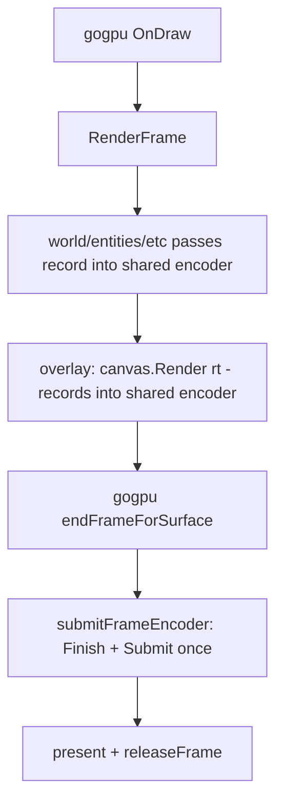
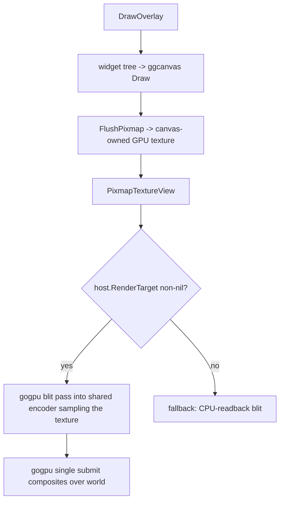

# PROJECT-SPEC-005: Single-Encoder GPU Composite (g3d Model)

- **Component Identifier:** PROJECT-SPEC-005
- **Name:** Single-Encoder GPU Composite for the Engine-Owned UI Overlay
- **Language/Runtime:** Go 1.26, gogpu/WebGPU (pure Go, CGO off)
- **Primary dependencies:** `github.com/gogpu/gogpu`, `github.com/gogpu/gg`,
  `github.com/gogpu/gg/integration/ggcanvas`, `github.com/gogpu/wgpu`
- **Target location:** `internal/renderer/*` (17 encoder sites), `internal/quakeui/overlay.go`,
  `internal/game/game_runtime_frame.go`, `internal/game/quakeui_host.go`
- **Status:** Draft
- **Date:** 2026-08-22
- **Related:** SPEC-004, ADRs 0011-0015, research 0008/0009,
  `internal/quakeui/notes/single-encoder-refactor.md`,
  `internal/quakeui/notes/gpu-direct-root-cause.md`

---

## 1. Overview

The engine-owned UI overlay (Scenario A, ADR-0011) composites the widget tree
over the 3D world. The renderer currently issues **17 independent
`CreateCommandEncoder` + `queue.Submit` pairs** per frame (world, aliases,
brushes, sky, liquid, decals, sprites, translucent, scene composite, overlay),
and gogpu's shared frame encoder is never used — so the engine is the sole
submitter and gogpu only presents.

This spec converts the renderer to the **g3d single-submit model**: all passes
record into gogpu's shared frame encoder (`dc.ctx.CommandEncoder()`), and
gogpu's `endFrameForSurface` → `submitFrameEncoder` finishes, submits,
presents, and releases once, in the correct order. This eliminates the
swapchain-lifetime race that caused `"command buffer references destroyed
texture"` (research 0009, `gpu-direct-root-cause.md`).

The gg accelerator is re-enabled, and the overlay composite uses the
**offscreen-composition path** (g3d model, gap 8): gg renders the widget tree
into a canvas-owned intermediate texture (`FlushPixmap` →
`PixmapTextureView`), and gogpu's own single submit blits that texture onto
the swapchain. gg never touches the swapchain image and never finishes/submits
the shared encoder — so the `FlushGPUWithView` submit bug (which would
re-introduce the race) is avoided entirely.

## 2. High-Level Agent Prompt

An implementer agent handed this spec must:

1. Convert every render pass in `internal/renderer` from
   `device.CreateCommandEncoder(...)` + `queue.Submit(cmdBuffer)` to recording
   into `dc.ctx.CommandEncoder()` (gogpu's shared frame encoder), with **no
   per-pass Finish/Submit**. gogpu's `submitFrameEncoder` finishes+submits once
   at frame end.
2. Re-enable the gg SDF accelerator (native-only blank import) and route the
   overlay composite through the **offscreen-composition path**: gg renders the
   widget tree into the ggcanvas, `FlushPixmap()` uploads it to a canvas-owned
   GPU texture, `PixmapTextureView()` exposes it, and a gogpu blit pass records
   into the shared encoder sampling that texture onto the swapchain. Do NOT use
   `canvas.Render(rt)`/`RenderDirect`/`FlushGPUWithView` (they finish+submit the
   shared encoder — the race). The CPU-readback blit becomes the fallback only
   when the offscreen path is unavailable (software/headless).
3. Preserve the world-preserve seam (`MarkPreserveContent`, ADR-0011) and the
   decoupled input router (ADR-0012) unchanged.
4. Add a soak/error-assert test that runs N frames with the menu open and
   asserts zero `references released/destroyed texture` submits.
5. Keep WASM + headless builds green; no `//go:build` tags beyond the
   platform files that already exist; CGO off.

Constraints:
- Do NOT change the widget tree, input router, or `MarkPreserveContent` seam.
- Do NOT introduce new submit sites. The engine's render passes issue NO
  submits; gogpu owns all submits (`submitFrameEncoder` + the overlay/blit
  path). Do NOT call `canvas.Render`/`RenderDirect`/`FlushGPUWithView` for the
  overlay — those finish+submit the shared encoder (gap 8).
- The offscreen scene-target (waterwarp) and depth passes may share the frame
  encoder (multiple render passes on one encoder targeting different textures
  is valid WebGPU) — fold them in (gap 2).
- The overlay composite must be a single pass into the shared encoder,
  unifying `flush2DOverlay` and the `DrawOverlay` blit (gap 3).
- Re-enabling the gg accelerator is REQUIRED (gap 4/5) — it is the point of
  the refactor.

## 3. Information Architecture / Topology

### 3.1 Current (multi-submit)

```
RenderFrame (engine-owned, inside gogpu OnDraw)
  ├─ world pass        → encoder#1  → submit
  ├─ alias entities    → encoder#2  → submit
  ├─ brush entities    → encoder#3..5 → submit
  ├─ sky/liquid        → encoder#6..7 → submit
  ├─ decals/sprites    → encoder#8..9 → submit
  ├─ translucent       → encoder#10..11 → submit
  ├─ scene composite   → encoder#12 → submit   (waterwarp, targets surface)
  ├─ overlay HAL       → encoder#13 → submit   (LoadOpLoad over world)
  └─ [gogpu submitFrameEncoder → no-op; present + release]
```

### 3.2 Target (single-submit)

```
RenderFrame (engine-owned, inside gogpu OnDraw)
  └─ shared frame encoder (dc.ctx.CommandEncoder())
       ├─ world pass        → BeginRenderPass/End
       ├─ alias entities    → BeginRenderPass/End
       ├─ brush entities    → BeginRenderPass/End
       ├─ sky/liquid        → BeginRenderPass/End
       ├─ decals/sprites    → BeginRenderPass/End
       ├─ translucent       → BeginRenderPass/End
       ├─ scene composite   → BeginRenderPass/End   (offscreen scene target)
       ├─ overlay blit (samples gg PixmapTextureView) → BeginRenderPass/End
       └─ [gogpu submitFrameEncoder → Finish + Submit once]
       └─ [gogpu present() + releaseFrame()]
```

### 3.3 Files touched

| File | Change |
| --- | --- |
| `internal/renderer/renderer_gogpu_world_render.go` | world + external sky + shared depth clear → shared encoder |
| `internal/renderer/renderer_gogpu_world_alias.go` | alias → shared encoder |
| `internal/renderer/renderer_gogpu_world_brush_render.go` | brush/sky/liquid → shared encoder |
| `internal/renderer/renderer_gogpu_world_decal.go` | decals → shared encoder |
| `internal/renderer/renderer_gogpu_world_sprite.go` | sprites → shared encoder |
| `internal/renderer/renderer_gogpu_world_translucent.go` | translucent → shared encoder |
| `internal/renderer/renderer_gogpu_warpscale.go` | scene clear + composite → shared encoder |
| `internal/renderer/overlay_composite_gogpu.go` | overlay HAL → shared encoder (single pass) |
| `internal/renderer/renderer_gogpu_runtime.go` | gg accelerator blank import (native) |
| `internal/renderer/gg_accelerator_native.go` / `_wasm.go` | re-add platform-gated accelerator |
| `internal/quakeui/overlay.go` | overlay composite → `canvas.Render(rt)` (GPU-direct) |
| `internal/game/game_runtime_frame.go`, `quakeui_host.go` | `RenderTarget()` plumbing (already present) |

## 4. Data Models / State

No new persistent state. Per-frame state changes:

- `dc.renderer.currentDrawCtx` (already present) is the active `DrawContext`;
  `dc.ctx.CommandEncoder()` returns gogpu's shared `ws.frameEncoder`.
- The overlay's CPU-readback blit path (`DrawRGBA`/`DrawRGBAFresh` +
  `renderOverlayTextureHAL`) is replaced by the GPU-direct `canvas.Render(rt)`
  pass; the readback blit becomes the fallback only when GPU-direct is
  unavailable (software adapter / headless).
- `s.frameRendered` in gg's render session must not be relied upon; the
  single-submit model means gg records into the shared encoder and never
  finishes/submits it (the `FlushGPUWithView` GPU-direct flush is NOT used;
  `canvas.Render` via `renderDirectToTarget` records only).

## 5. State Machines / Flows

### 5.1 Frame flow (target)



### 5.2 Overlay composite decision (offscreen-composition, path 1)



## 6. Security Model

- **Mod/plugin trust:** unchanged. The UI overlay renders engine-owned widget
  state; no new input provenance boundary.
- **Isolation boundary (ADR-0013):** unchanged — `internal/quakeui` stays
  isolated; the `Host` adapter (with `RenderTarget()`) is the only bridge.
- **GPU resource lifetime:** the single-submit model is the security-relevant
  change: no independent submit can reference a swapchain image that gogpu
  released. This is a correctness/lifetime boundary, not a trust boundary.

## 7. Edge Cases & Failure Handling

1. **Software adapter / headless (AC3c):** `host.RenderTarget()` is nil or
   `canvas.Render` fails → fall back to the CPU-readback blit (existing path).
   No panic, no GPU attempt.
2. **WASM (AC3b):** gg accelerator is gated off (`wgpu/core` excluded on
   js/wasm) → `canvas.Render` uses the software/universal path; the shared
   encoder still works (gogpu owns submit).
3. **Scene target (waterwarp):** the scene composite pass targets the offscreen
   scene texture but records into the shared encoder — valid (multi-pass, one
   encoder). `MarkPreserveContent` is called AFTER the composite (ADR-0011 A2).
4. **Deferred clear:** gogpu's `CommandEncoder()` flushes a pending clear into
   the shared encoder before external passes. The engine's own depth/scene
   clears are folded in as passes (gap 2).
5. **gg `FlushGPUWithView` submit bug (gap 8):** the overlay MUST NOT use
   `canvas.Render`/`RenderDirect`/`FlushGPUWithView` — those finish+submit the
   shared encoder (the race). The offscreen-composition path (gg flushes to a
   canvas-owned texture, gogpu blits in its own submit) is the ONLY overlay
   path that re-enables the accelerator without the race. Hard acceptance gate
   (research `gpu-direct-root-cause.md` §5).

## 8. Acceptance Criteria

| AC | Criterion | Implementer-verifiable check |
| --- | --- | --- |
| AC1 | All 17 encoder sites record into the shared frame encoder; the engine's passes issue NO submits (gogpu owns all submits) | grep `CreateCommandEncoder` in `internal/renderer/*.go` returns only gogpu's `ensureFrameEncoder`; grep `queue.Submit` in engine passes returns none |
| AC2 | gg accelerator re-enabled (native) and overlay uses offscreen-composition (gg FlushPixmap -> PixmapTextureView -> gogpu blit into shared encoder) | `gg_accelerator_native.go` present; `DrawOverlay` uses FlushPixmap/PixmapTextureView + gogpu blit; no `canvas.Render`/`RenderDirect`/`FlushGPUWithView` for the overlay; CPU-readback blit is fallback only |
| AC3 | Zero `references released/destroyed texture` submits in a soak run; world non-black; overlay blit happened | new soak test: N (>=1000) frames with menu open, assert zero such errors AND a non-black world sample AND an overlay draw recorded |
| AC4 | WASM build green; headless fail-open preserved | `GOOS=js go build`; headless smoke at `ui_backend 1` |
| AC5 | World renders under the menu; overlay visible; menu/console/HUD/demo bar functional | smoke-menu + in-window check |
| AC6 | No `//go:build` tags beyond existing platform files; CGO off | grep + `go build` with CGO off |

## 9. Cross-References

- SPEC-004 (v4 UI rewrite), ADR-0011 (Scenario A composite), ADR-0012 (input
  router), ADR-0013 (isolation)
- Research 0008 (three-branch evaluation), 0009 (v4 findings)
- `internal/quakeui/notes/single-encoder-refactor.md` (the refactor path)
- `internal/quakeui/notes/gpu-direct-root-cause.md` (the race + gg flush bug)
- gogpu `context.go` `CommandEncoder()` / `ensureFrameEncoder()` /
  `submitFrameEncoder` / `endFrameForSurface`

## Review Log

### Stage 3 — Review 1 (2026-08-22)

Verdict: APPROVED WITH FIXES. Hostile review found a critical flaw (gap 8):
`canvas.Render(rt)`'s GPU-direct path calls `FlushGPUWithView` which
finishes+submits the shared encoder — re-introducing the race. Resolved by
switching the overlay composite to the **offscreen-composition path** (gg
`FlushPixmap` → `PixmapTextureView` → gogpu blit into the shared encoder),
which re-enables the accelerator without any gg submit. Also fixed AC1
("engine passes issue no submits; gogpu owns all submits"), AC2 (offscreen
path, not canvas.Render), §5.2 flow, and §7.5 (hard gate: no
FlushGPUWithView). Gaps 8-12 RESOLVED (8-10 fixed in spec; 11-12 folded into
AC3/verification).

## Change Log

- **2026-08-22 (Review 1):** Overlay composite switched from `canvas.Render(rt)`
  to **offscreen-composition** (gg `FlushPixmap` → `PixmapTextureView` → gogpu
  blit into shared encoder) after Review 1 found `canvas.Render`'s GPU-direct
  path submits the shared encoder (gap 8). AC1/AC2/§5.2/§7.5 updated; AC3 soak
  strengthened (zero errors + world non-black + overlay blit recorded).
