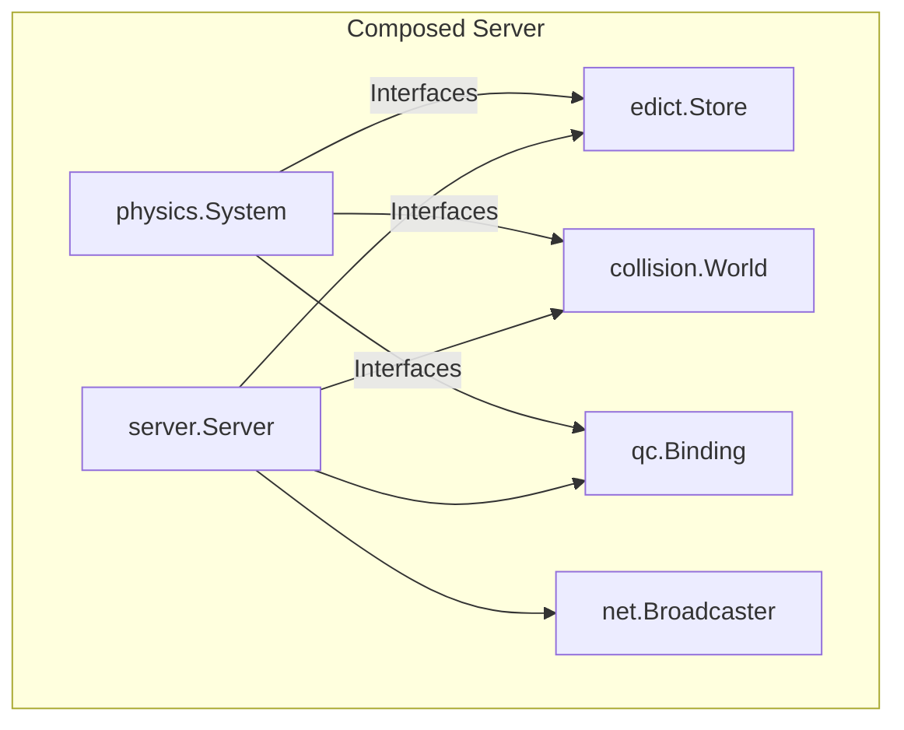
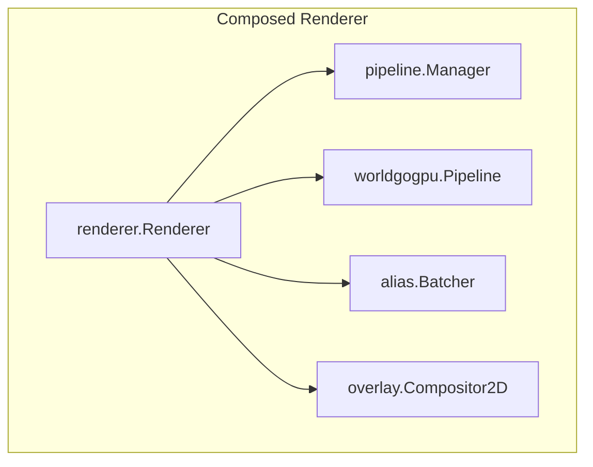
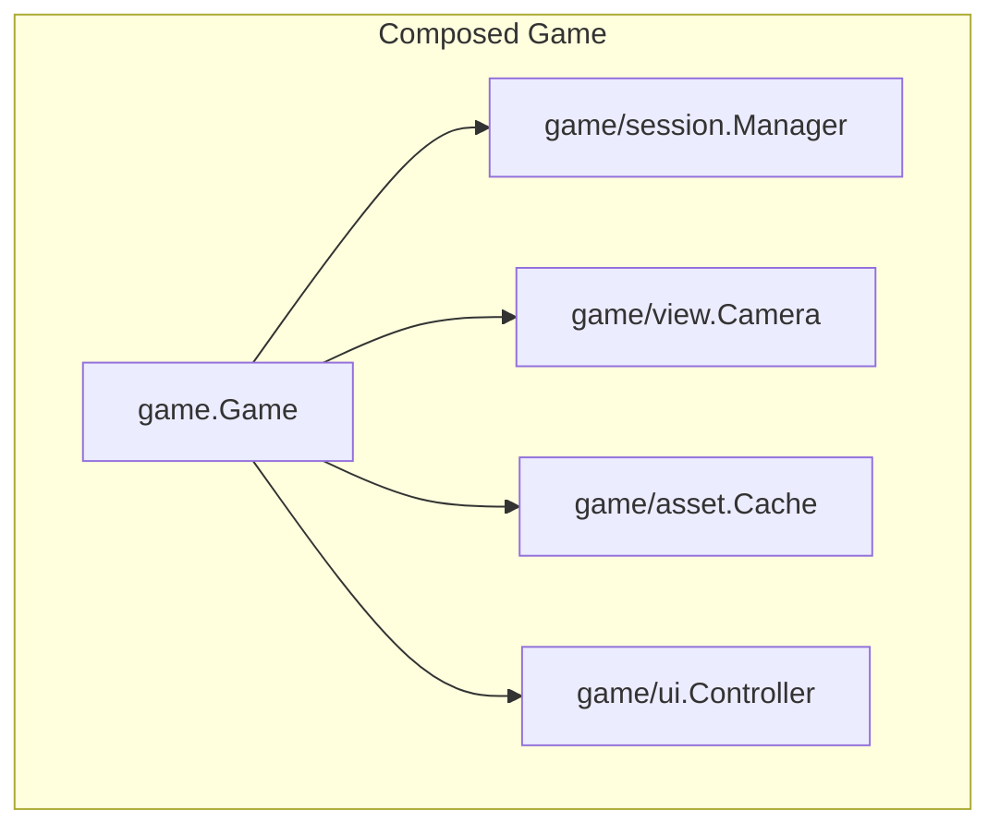

# Architectural Decomposition & Subpackage Refactoring Strategy

This document presents a comprehensive analysis and refactoring blueprint for breaking down the monolithic "megastructs" in `ironwail-go` (`server.Server`, `renderer.Renderer`, and `game.Game`) into modular, loosely coupled sub-components.

---

## 1. Executive Summary & Root Cause Analysis

### Root Cause of Subpackage Extraction Obstacles
During earlier refactoring passes, attempting to extract code into subpackages (such as `server/physics` or `renderer/world/gogpu`) led to compiler errors or circular imports. The primary cause:

1. **Direct Megastruct Field Access**: Subsystem logic relies directly on struct fields (e.g., `s.Edicts`, `s.QCVM`, `r.worldData`, `g.Client`).
2. **Unexported Method Coupling**: Helper routines rely on unexported methods attached to the parent struct (e.g., `s.runClientQCThinkWithMode`, `s.playerClient`, `r.ensureAliasStateLocked`).
3. **Circular Import Constraints**: Go prohibits a subpackage (e.g. `internal/server/physics`) from importing its parent package (`internal/server`). Therefore, any function operating on `*server.Server` must remain in `package server`.

### Core Solution Principles
To enable clean migration into subpackages:
- **Decompose Megastructs**: Replace monolithic fields with embedded/composed sub-components.
- **Inversion of Control (Dependency Injection)**: Pass narrow interfaces to subpackages rather than whole struct pointers.
- **Seam Identification**: Group fields and methods by domain capability (Spatial Collision, Entity Storage, GPU Pipeline, Asset Caching, Camera View).

---

## 2. `internal/server` Decomposition Strategy



### Problem Areas in `server.Server`
`server.Server` (~1,000 lines, 60+ fields) currently manages:
1. Per-edict memory & allocation (`Edicts []*Edict`).
2. Spatial BSP partitioning (`Areanodes []AreaNode`).
3. Physics, step moves, unsticking, and pushers.
4. QuakeC VM execution, global mirroring, and field def offset caches.
5. Client signon creation, datagrams, and network broadcasts.

### Proposed Component Seams & Interfaces

| Component | Responsibility | Extracted State | Interface Provided |
| :--- | :--- | :--- | :--- |
| **`server/edict.Store`** | Entity allocation, free lists, edict array indexing. | `Edicts`, `NumEdicts`, `MaxEdicts`, `peakEdicts` | `EdictStore` (`Edict(num int) *Edict`, `Alloc() *Edict`, `Free(e *Edict)`) |
| **`server/collision.World`** | AreaNode tree, hull traces, point contents, edict linking. | `Areanodes`, `numAreaNodes`, `WorldTree`, `WorldModel` | `CollisionWorld` (`LinkEdict`, `UnlinkEdict`, `PointContents`, `HullForEntity`, `MoveTrace`) |
| **`server/qc.Binding`** | VM function invocation, field def offset resolution, global mirroring. | `QCVM`, `QCFieldAlpha`, `QCFieldScale`, `QCFieldGravity`, `QCFieldState`, etc. | `QCExecutor` (`RunThink`, `ExecuteQCFunction`, `RunClientQCThink`, `SyncGlobals`) |
| **`server/net.Broadcaster`** | Signon buffer building, datagram assembly, entity delta serialization. | `Datagram`, `ReliableDatagram`, `SignonBuffers`, `SignonWriter`, `PrecacheLists` | `NetworkBroadcaster` (`StartSound`, `StartParticle`, `WriteSignon`) |

### Composed `Server` Definition
```go
type Server struct {
    Edicts    *edict.Store
    Collision *collision.World
    QC        *qc.Binding
    Net       *net.Broadcaster
    Physics   *physics.System
    // Server frame loop becomes a high-level orchestrator calling interface methods.
}
```

---

## 3. `internal/renderer` Decomposition Strategy



### Problem Areas in `renderer.Renderer` / `GOGPURenderer`
`renderer.Renderer` combines window/event loops, 2D font compositing, GPU pipeline creation, BSP world rendering passes, alias model interpolation, and particle/decal scratch buffers into a single 200+ field struct.

### Proposed Component Seams & Interfaces

| Component | Responsibility | Extracted State | Interface Provided |
| :--- | :--- | :--- | :--- |
| **`renderer/world/gogpu.Pipeline`** | WebGPU BSP world rendering, lightmap pages, texture atlas arrays, translucent liquid sorting, skybox faces. | `worldData`, `worldVertexBuffer`, `worldIndexBuffer`, `worldTextures`, `worldBatchCache` | `WorldPipeline` (`UploadWorld`, `DrawWorldOpaque`, `DrawWorldTranslucent`, `DrawSky`) |
| **`renderer/alias.Batcher`** | Alias model pose interpolation, skin texture upload, draw call preparation. | `aliasEntityStates`, `viewModelAliasState`, `aliasPreparedScratch`, `aliasVertexScratch` | `AliasBatcher` (`PrepareAliasDraws`, `DrawAliasModels`) |
| **`renderer/overlay.Compositor2D`** | CPU-side 2D quad compositing, font glyph caching, 2D texture uploads. | `overlay`, `concharsData`, `charCache`, `charTextures`, `colorTextures` | `Compositor2D` (`DrawPic`, `DrawCharacter`, `DrawString`, `FlushOverlay`) |
| **`renderer/pipeline.Manager`** | Low-level WGPU device/queue management, depth-stencil states, pipeline descriptors. | `app`, `config`, `resources`, `wgpu.Device`, `wgpu.Queue` | `GPUContext` (`Device()`, `Queue()`, `CreatePipeline()`) |

### Composed `Renderer` Definition
```go
type Renderer struct {
    gpu     *pipeline.Manager
    world   *worldgogpu.Pipeline
    alias   *alias.Batcher
    overlay *overlay.Compositor2D
    // Top-level Renderer acts as a thin facade.
}
```

---

## 4. `internal/game` Decomposition Strategy



### Problem Areas in `game.Game`
`game.Game` is the engine's primary "god object", storing pointers to every subsystem (`Host`, `Server`, `Client`, `Renderer`, `QC`, `CSQC`, `Menu`, `Input`, `Draw`, `HUD`, `Audio`) alongside asset caches, camera zoom state, and per-frame measurement statistics.

### Proposed Component Seams & Interfaces

| Component | Responsibility | Extracted State | Interface Provided |
| :--- | :--- | :--- | :--- |
| **`game/session.Manager`** | Coordinates Host/Server/Client lifecycle, single-player vs multiplayer, intermission progression. | `Host`, `Server`, `Client`, `QC`, `CSQC`, `processClientPhase` | `SessionManager` (`UpdateSession`, `AdvanceFrame`, `IsActive`) |
| **`game/view.Camera`** | View calculation (`viewcalc`), chase camera positioning, underwater FOV modulation, scope zoom. | `Zoom`, `ZoomDir`, `CameraInLiquid`, `CameraLeafContents` | `CameraSystem` (`ComputeView`, `UpdateZoom`, `CameraState`) |
| **`game/asset.Cache`** | Precached models, sound effects, sprite structures, BSP trees. | `AliasModelCache`, `SpriteModelCache`, `BrushModelCache`, `SoundSFXByIndex` | `AssetCache` (`GetModel`, `GetSFX`, `PrecacheSound`) |
| **`game/ui.Controller`** | HUD state, menu system, 2D drawing, input keybindings, debug overlays. | `Menu`, `Input`, `Draw`, `HUD`, `FPSOverlay`, `SpeedOverlay`, `DemoOverlay` | `UIController` (`RenderHUD`, `ProcessInput`, `DrawOverlays`) |

### Composed `Game` Definition
```go
type Game struct {
    Session *session.Manager
    Camera  *view.Camera
    Assets  *asset.Cache
    UI      *ui.Controller
}
```

---

## 5. Migration Execution Roadmap

To execute this decomposition safely without breaking behavioral parity or test suites:

1. **Phase A (Interfaces & Wrappers)**:
   - Define subpackage interfaces (`EdictStore`, `CollisionWorld`, `WorldPipeline`, etc.) in `types` or target subpackages.
   - Implement getters/adapters on the megastructs (`Server`, `Renderer`, `Game`) so they immediately satisfy the new interfaces.

2. **Phase B (Internal Field Grouping)**:
   - Group related fields into sub-structs inside the megastructs (e.g. `s.Edicts` becomes `s.edicts.store`).
   - Move helper functions to operate on sub-struct receivers.

3. **Phase C (Subpackage Extraction)**:
   - Move sub-structs and their receiver methods into target subpackages (`server/edict`, `server/collision`, `renderer/world/gogpu`, `game/camera`).
   - Pass narrow interface dependencies during construction (Dependency Injection).
