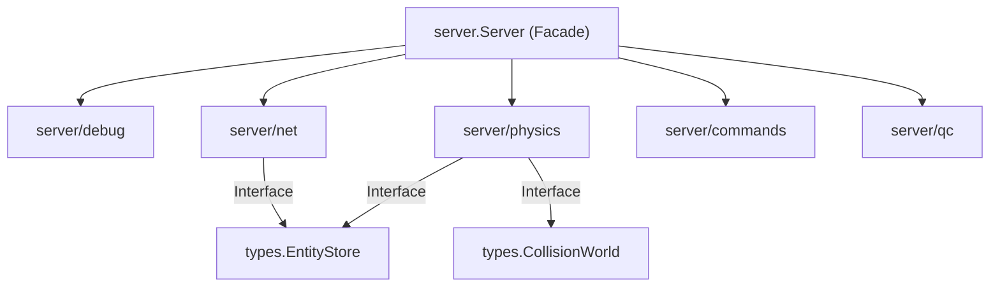
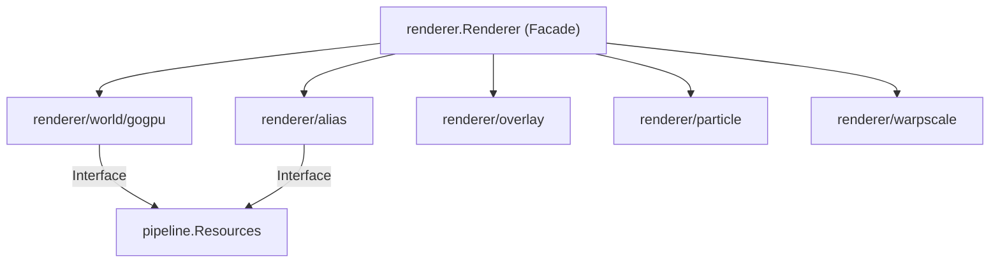
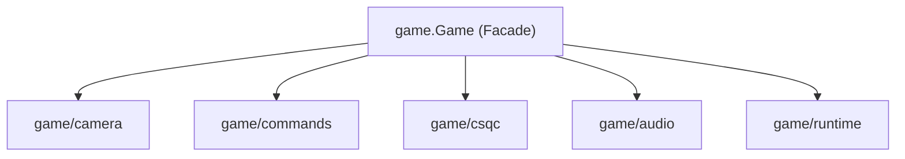

# Subpackage Architecture & Dependency Injection Specification

This specification presents a comprehensive blueprint for physically extracting code and test suites from `internal/server`, `internal/renderer`, and `internal/game` into standalone subpackages.

---

## 1. Specification for `internal/server` Subpackages

### 1.1 `internal/server/debug`
- **Responsibility**: Telemetry logging (`sv_debug_telemetry`), trigger execution tracing, debug console formatting.
- **Files to Move**: `debug_telemetry.go`, `debug_telemetry_test.go`, `debug_trigger.go`, `svdbg.go`, `svdbg_test.go`.
- **Target Package & Exported Types**: `package debug`, `type Telemetry struct`, `type EventMask uint32`.
- **Interface Contract**: `TelemetryLogger` (`LogTrigger`, `LogQCEvent`, `LogPhysicsEvent`).
- **Injected Dependencies**: None (leaf logger).

### 1.2 `internal/server/net`
- **Responsibility**: Client network connections, PVS visibility calculation, datagram serialization, entity state delta encoding (`WriteEntitiesToClient`), signon buffers.
- **Files to Move**: `network_manager.go`, `server_net_main.go`, `server_net_send.go`, `sv_client.go`, `sv_pvs.go`, `sv_stats.go`, `message.go`, `message_test.go`, `sv_send_clientdata_test.go`, `sv_send_entities_test.go`, `sv_send_sound_protocol_test.go`, `sv_send_test.go`, `sv_client_test.go`, `signon_test.go`.
- **Target Package & Exported Types**: `package net`, `type NetworkManager struct`, `type Client struct`, `type MessageBuffer struct`.
- **Interface Contract**: `NetworkBroadcaster` (`StartSound`, `StartParticle`, `WriteSignon`, `SendClientMessages`, `Multicast`).
- **Injected Dependencies**: `srvtypes.EntityStore`, `srvtypes.CollisionWorld`, `inet.Network`.

### 1.3 `internal/server/physics`
- **Responsibility**: Velocity checks, gravity, step movement, unsticking, pusher origin restore, monster walkmove (`SV_WalkMove`, `SV_MoveToGoal`).
- **Files to Move**: `physics_system.go`, `server_physics.go`, `server_physics_loop.go`, `server_physics_walk.go`, `movement.go`, `movement_test.go`, `physics_test.go`, `physics_parity_test.go`, `physics_runthink_test.go`, `frame_physics_parity_test.go`, `synthetic_movement_test.go`.
- **Target Package & Exported Types**: `package physics`, `type System struct`.
- **Interface Contract**: `PhysicsEngine` (`CheckVelocity`, `AddGravity`, `SV_CheckWater`, `PushEntity`, `SV_Physics`, `SV_WalkMove`).
- **Injected Dependencies**: `srvtypes.CollisionWorld`, `srvtypes.EntityStore`, `srvtypes.PhysicsConfig`, `srvtypes.FrameTiming`, `srvtypes.ThinkExecutor`.

### 1.4 `internal/server/commands`
- **Responsibility**: Server user command handlers (`noclip`, `god`, `kill`, `say`, `give`, `setpos`, `prespawn`), spawn parameter parsing, game rules (coop/deathmatch).
- **Files to Move**: `server_user_commands.go`, `user_spawn.go`, `spawn_parms.go`, `rules.go`, `rules_test.go`, `skill.go`, `user_test.go`.
- **Target Package & Exported Types**: `package commands`, `type Handler struct`, `type SpawnParms struct`, `type GameRules struct`.
- **Interface Contract**: `UserCommandExecutor` (`ExecuteUserCommand`, `ParseSpawnParms`, `IsCoop`, `IsDeathmatch`).
- **Injected Dependencies**: `srvtypes.EntityStore`, `srvtypes.PhysicsConfig`, `cvar.CVarSystem`.

### 1.5 `internal/server/qc`
- **Responsibility**: QuakeC VM field offset maps, VM bytecode execution tracing, Go/VM memory mirroring (`syncQCVMState`, `syncQCVMGlobals`).
- **Files to Move**: `qc_fields.go`, `qc_trace.go`, `server_qc_sync.go`, `qc_trace_test.go`, `qcvm_regression_test.go`, `map_entity_qcvm_test.go`.
- **Target Package & Exported Types**: `package qc`, `type Binding struct`, `type TraceLogger struct`.
- **Interface Contract**: `QCExecutor` (`RunThink`, `ExecuteQCFunction`, `RunClientQCThink`, `SyncGlobals`).
- **Injected Dependencies**: `*qc.VM`, `srvtypes.EntityStore`.

---

## 2. Specification for `internal/renderer` Subpackages

### 2.1 `internal/renderer/world/gogpu`
- **Responsibility**: WebGPU BSP world geometry pipeline, render pass encoders, lightmap texture page updates, decal & sprite passes, translucent liquid sorting, skybox rendering.
- **Files to Move**: `renderer_gogpu_world_render.go`, `renderer_gogpu_world_pipelines.go`, `renderer_gogpu_world_resources.go`, `renderer_gogpu_world_shaders.go`, `renderer_gogpu_world_upload.go`, `renderer_gogpu_world_brush_render.go`, `renderer_gogpu_world_decal.go`, `renderer_gogpu_world_sprite.go`, `renderer_gogpu_world_translucent.go`, `renderer_gogpu_world_depth.go`, `renderer_gogpu_world_test.go`, `renderer_gogpu_world_*.go`.
- **Target Package & Exported Types**: `package worldgogpu`, `type Pipeline struct`.
- **Interface Contract**: `WorldPipeline` (`UploadWorld`, `DrawWorldOpaque`, `DrawWorldTranslucent`, `DrawSky`).
- **Injected Dependencies**: `pipeline.Resources`, `wgpu.Device`, `wgpu.Queue`.

### 2.2 `internal/renderer/alias`
- **Responsibility**: Alias model frame pose interpolation, skin texture variant cache, vertex/uniform scratch buffer preparation, alias draw execution.
- **Files to Move**: `renderer_alias_skin.go`, `renderer_alias_skin_variants.go`, `renderer_alias_state.go`, `renderer_gogpu_world_alias.go`, `renderer_alias_skin_test.go`, `renderer_alias_skin_variants_test.go`.
- **Target Package & Exported Types**: `package alias`, `type Batcher struct`, `type Model struct`.
- **Interface Contract**: `AliasBatcher` (`PrepareAliasDraws`, `DrawAliasModels`).
- **Injected Dependencies**: `pipeline.Resources`, `wgpu.Device`.

### 2.3 `internal/renderer/overlay`
- **Responsibility**: CPU 2D overlay compositor buffer, font glyph texture cache, 2D quad upload & flush.
- **Files to Move**: `renderer_gogpu_overlay.go`, `renderer_gogpu_overlay_test.go`, `overlay_composite_gogpu.go`.
- **Target Package & Exported Types**: `package overlay`, `type Compositor2D struct`.
- **Interface Contract**: `Compositor2D` (`DrawPic`, `DrawCharacter`, `DrawString`, `FlushOverlay`).
- **Injected Dependencies**: `pipeline.Resources`, `wgpu.Device`.

### 2.4 `internal/renderer/particle`
- **Responsibility**: GPU particle scratch buffer, particle texture atlas, particle render pipeline encoder.
- **Files to Move**: `renderer_gogpu_particle.go`, `particle.go`, `particle_test.go`.
- **Target Package & Exported Types**: `package particle`, `type ParticleSystem struct`.
- **Interface Contract**: `ParticleRenderer` (`UploadParticles`, `DrawParticles`).
- **Injected Dependencies**: `pipeline.Resources`, `wgpu.Device`.

### 2.5 `internal/renderer/warpscale`
- **Responsibility**: Underwater sinusoidal waterwarp post-process pipeline and FOV warp effect rendering.
- **Files to Move**: `renderer_gogpu_warpscale.go`, `renderer_gogpu_warpscale_test.go`, `warpscale_shared.go`.
- **Target Package & Exported Types**: `package warpscale`, `type Pipeline struct`.
- **Interface Contract**: `WarpscaleRenderer` (`RenderWaterWarp`).
- **Injected Dependencies**: `pipeline.Resources`, `wgpu.Device`.

---

## 3. Specification for `internal/game` Subpackages

### 3.1 `internal/game/camera`
- **Responsibility**: View matrix calculation (`viewcalc`), chase camera placement, scope zoom state, underwater FOV waterwarp modulation.
- **Files to Move**: `game_camera.go`, `game_camera_chase.go`, `game_camera_viewcalc.go`, `game_view_state_camera_test.go`, `game_view_state_test.go`.
- **Target Package & Exported Types**: `package camera`, `type System struct`.
- **Interface Contract**: `CameraSystem` (`ComputeView`, `UpdateZoom`, `CameraState`).
- **Injected Dependencies**: `cvar.CVarSystem`.

### 3.2 `internal/game/commands`
- **Responsibility**: Console command dispatching (`exec`, `bind`, `unbind`), debug camera controls, viewpoint toggles, performance measurement commands (`perf_warmup`, `perf_capture`).
- **Files to Move**: `game_commands.go`, `game_commands_bindings.go`, `game_commands_camdebug.go`, `game_commands_dispatch.go`, `game_commands_viewpoint.go`, `game_commands_camdebug_test.go`, `game_commands_profile_test.go`, `game_commands_viewpoint_test.go`, `perf_commands_test.go`.
- **Target Package & Exported Types**: `package commands`, `type Dispatcher struct`.
- **Interface Contract**: `CommandDispatcher` (`DispatchCommand`, `RegisterBindings`).
- **Injected Dependencies**: `cmdsys.CmdSystem`, `cvar.CVarSystem`.

### 3.3 `internal/game/csqc`
- **Responsibility**: Client-Side QuakeC VM event dispatching (`CSQC_UpdateView`, `CSQC_InputEvent`).
- **Files to Move**: `game_runtime_csqc.go`, `game_runtime_csqc_test.go`, `csqc_input_test.go`.
- **Target Package & Exported Types**: `package csqc`, `type Engine struct`.
- **Interface Contract**: `CSQCEngine` (`UpdateView`, `InputEvent`).
- **Injected Dependencies**: `*qc.CSQC`.

### 3.4 `internal/game/audio`
- **Responsibility**: Sound effect precache tracking, spatial 3D audio updates, ambient sound loops, music playback adapter.
- **Files to Move**: `game_audio.go`, `game_audio_visual_sprites_test.go`, `game_audio_visual_test.go`, `game_music_test.go`.
- **Target Package & Exported Types**: `package audio`, `type Manager struct`.
- **Interface Contract**: `AudioManager` (`PlaySFX`, `UpdateAudio`, `PrecacheSound`).
- **Injected Dependencies**: `audio.AudioAdapter`.

### 3.5 `internal/game/runtime`
- **Responsibility**: Frame tick coordination, overlay render triggers, UI event loops.
- **Files to Move**: `game_runtime_frame.go`, `game_runtime_frame_parity_test.go`, `game_runtime_overlay.go`, `game_runtime_overlay_test.go`, `game_runtime_ui.go`, `game_runtime_ui_test.go`, `game_loop.go`, `game_loop_runtime_test.go`.
- **Target Package & Exported Types**: `package runtime`, `type Engine struct`.
- **Interface Contract**: `RuntimeEngine` (`AdvanceFrame`, `RenderFrame`).
- **Injected Dependencies**: `host.Host`, `server.Server`, `client.Client`.
